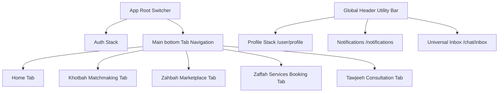

# KOSHA: Information Architecture & Navigation
## Mobile Navigation Hierarchy, Flow Maps, and Deep-Linking Specifications

KOSHA is structured to deliver an integrated, cohesive mobile experience. The navigation system uses a hybrid model: a main bottom tab navigation bar for discoverability, a persistent top global utility bar for universal actions, and modal bottom sheets for secondary detail collection.

---

## 1. Global Navigation Paradigm



### Bottom Tab Navigation Structure
1. **Home (`/home`)**: Central discovery, curated vendor spotlight, expert column previews, and active order shortcuts.
2. **Khotbah (`/khotbah`)**: Matchmaking portal. Locks/unlocks directory based on active subscription.
3. **Zahbah (`/zahbah`)**: E-commerce storefront. Browse physical products (dresses, rings, cards).
4. **Zaffah (`/zaffah`)**: Service directory. Book halls, photographers, makeup artists, and planners.
5. **Tawjeeh (`/tawjeeh`)**: Family and social counseling. Directories, calendars, and live sessions.

### Global Header Utility Bar (Persistent on main tabs)
* **Left**: User Profile Avatar -> navigates to `/profile` (User Settings, Addresses, Orders).
* **Center**: KOSHA Logo (Interactive, scrolling to top of active list).
* **Right**:
  * `/notifications` (Bell icon with badge indicator).
  * `/chat/inbox` (Mail icon for unified chat threads across matchmaking and vendors).

---

## 2. Detailed Navigation Stack & Routes

### Route Directory Schema

```
/ (Root Switcher)
├── /auth (Stack)
│   ├── /onboarding (Onboarding slider)
│   ├── /login (Email OTP & UAE Pass Entry)
│   └── /registration (Role selection, onboarding questions)
├── /main (Tabs)
│   ├── /home (Stack)
│   ├── /khotbah (Stack)
│   │   ├── /gateway (Subscription paywall)
│   │   ├── /directory (Matching listing)
│   │   └── /profile/:userId (Anonymized profile view)
│   ├── /zahbah (Stack)
│   │   ├── /shop (Marketplace catalog)
│   │   └── /product/:productId (Details and specs)
│   ├── /zaffah (Stack)
│   │   ├── /catalog (Services & venues list)
│   │   └── /service/:serviceId (Details & intake form)
│   └── /tawjeeh (Stack)
│       ├── /specialists (Couselors list)
│       └── /specialist/:specialistId (Calendar & booking slot)
└── /shared (Nested Stack, fullscreen overlay)
    ├── /cart (Universal cart for products & bookings)
    ├── /checkout (Delivery details, payment method selection)
    ├── /invoice/:invoiceId (Payment summary & Stripe gateway)
    ├── /chat/room/:chatRoomId (Secure messaging panel)
    ├── /live/:sessionId (Video/audio live stream console)
    └── /profile (Personal profile editor and settings)
```

---

## 3. Core Interaction & Transaction Flows

### Flow A: User Authentication & Onboarding
1. **App Install** -> Launch Splash -> Slide transition to Onboarding carousel (3 cards detailing Khotbah, Zaffah/Zahbah, Tawjeeh).
2. **Click "Get Started"** -> `/auth/login`. Prompt email or **UAE Pass** login.
3. **verification** -> Send and verify OTP code. If UAE Pass, redirect to UAE Pass secure web view / sandbox, returns validated identity.
4. **Identity Routing**:
   * *New User*: Route to `/auth/registration` -> Role selector: `Individual User`, `Supplier`, `Specialist`.
   * *Existing User*: Route directly to `/main/home`.

### Flow B: Khotbah Matchmaking Flow
1. **Click Tab 2 (`/khotbah`)** -> API checks subscription state.
2. **If Unsubscribed**: Route to `/khotbah/gateway` -> Explanatory screens, terms of safe matchmaking, payment card component (Stripe, monthly subscription auto-renew).
3. **If Subscribed**: Show `/khotbah/directory` -> Multi-choice filters (Age range, location emirate, religious/cultural views, occupation).
4. **Browse**: Swipe profile cards. Click card -> Open `/khotbah/profile/:userId` (displays anonymized details: hobbies, educational background, family expectations).
5. **Connect**: Click "Send Connection Request" -> triggers Selection haptic. Input short intro message.
6. **Acceptance**: Receiving user views request in `/chat/inbox` -> Click Approve -> Creates `/chat/room/:chatRoomId`.
7. **Secure Messaging**: Chat session loads. Real-time scanning script monitors text for numbers/emails/links and blocks transmission. Warning toast shown on violation.

### Flow C: Zaffah Booking & Intake Flow
1. **Navigate to `/zaffah/catalog`** -> Browse Venues, Planners, Photographers. Smart filter by capacity and price slider.
2. **Select Vendor** -> Open `/zaffah/service/:serviceId`. Showcase 3D virtual tour of hall or editorial photo gallery.
3. **Click "Book Venue"** -> Slider transition opens custom intake form (Service Date, Guest Count, Theme Preference, Custom notes).
4. **Submit Intake Form** -> Adds service to `/shared/cart` -> Navigate to `/shared/checkout` -> Submit booking request.
5. **Vendor Validation**: Booking status is marked "Pending Supplier Review". Vendor receives a push notification on their panel.
6. **Approval & Payment**: Vendor approves -> User receives alert -> Open `/shared/invoice/:invoiceId` -> Complete payment via Apple Pay or Stripe (in AED).
7. **Tracking**: Redirects to `/shared/orders/tracking`.

### Flow D: Zahbah E-Commerce Marketplace Flow
1. **Navigate to `/zahbah/shop`** -> Grid list of products (wedding outfits, jewelry, invitations). Filter by category.
2. **Select Product** -> Open `/zahbah/product/:productId`. Select variations (color, size, count).
3. **Add to Cart** -> Button morphs to a checkmark (Stripe-style animation). Adds product to `/shared/cart`.
4. **Checkout** -> Open `/shared/checkout` -> Enter delivery address, checkout methods -> Submit order request.
5. **Supplier Confirmation**: Supplier accepts order (verifies inventory) -> invoice generated.
6. **Payment & Shipment**: User pays invoice -> order state changes to "Processing" -> Supplier ships -> user monitors delivery courier in `/shared/orders/tracking`.

### Flow E: Tawjeeh Counseling Flow
1. **Navigate to `/tawjeeh/specialists`** -> Filter by specialty: Legal, Psychological, Marital.
2. **Select Specialist** -> Open `/tawjeeh/specialist/:specialistId`. View specialist's bio, rating stars, and video introduction.
3. **Book Slot**: Scroll horizontal calendar strip -> Select day -> Select hourly slot -> Click "Request Session".
4. **Approval**: Specialist approves slot -> Stripe invoice is generated -> User completes payment in `/shared/invoice/:invoiceId`.
5. **Consultation**: At the appointed time, push notification triggers. Clicking navigates user to `/shared/live/:sessionId`.
6. **Live Stream**: Full screen video/audio session using WebRTC, incorporating a picture-in-picture view and a secure shared notes canvas.
7. **Close Session**: User exits -> Rating sheet slides up (`/shared/reviews/rate`).

---

## 4. Deep-Linking Schema

To drive engagement via email, SMS notifications, and external share sheets, KOSHA supports the following deep-link URI schemas:

| Screen Destination | Deep Link URI | Expected Action |
| :--- | :--- | :--- |
| **Unified Inbox** | `kosha://chat/inbox` | Redirects to universal message threads |
| **Secure Chat Room** | `kosha://chat/room/{chatRoomId}` | Direct access to active matchmaking or vendor chat |
| **Specialist Profile** | `kosha://tawjeeh/specialist/{specialistId}` | Directly opens counselor's booking calendar |
| **Product Marketplace** | `kosha://zahbah/product/{productId}` | Opens product catalog details for social sharing |
| **Service Booking Details**| `kosha://zaffah/service/{serviceId}` | Opens specific venue booking portal |
| **Active Invoice** | `kosha://invoice/{invoiceId}` | Launches payment screen with Stripe interface |
| **Live Consultation Room** | `kosha://live/{sessionId}` | Launches video room (bypass main tabs directly) |
