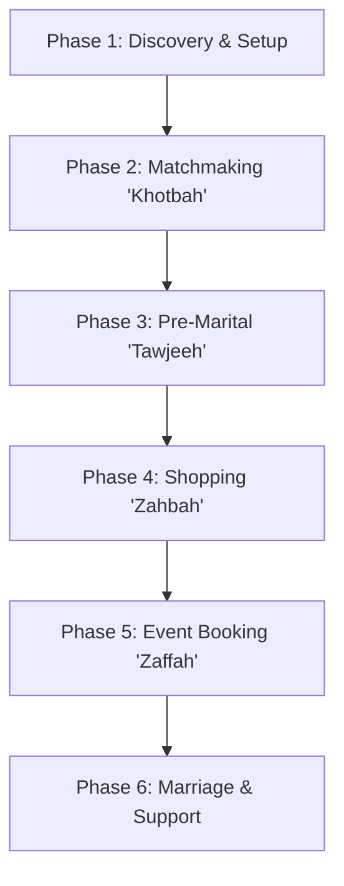
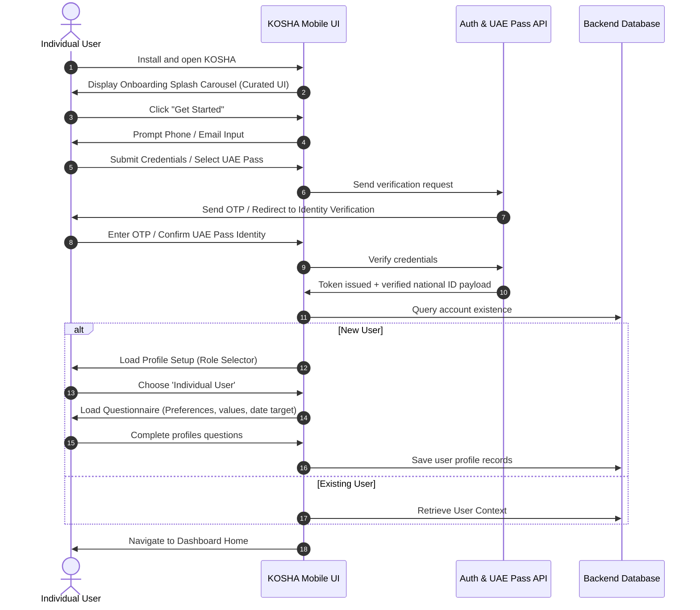
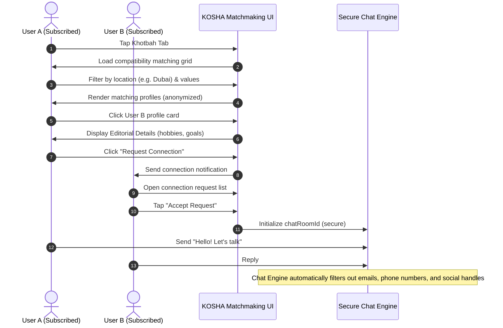
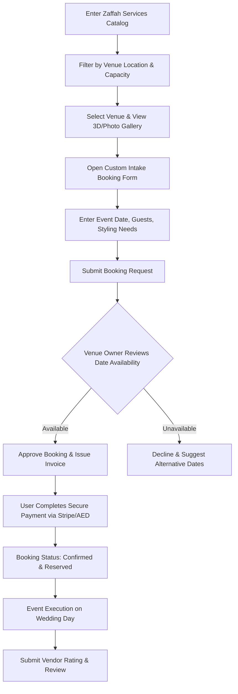

# KOSHA: End-to-End User Journeys
## Customer Lifecycle Maps: From Onboarding to Marriage

The KOSHA user journey spans six key phases, transitioning the user from single and planning to married and supported. Below are the visual maps and detailed touchpoint specifications for each stage of the lifecycle.

---

## 1. Lifecycle Journey Overview

---

## 2. Phase-by-Phase Walkthrough

### Phase 1: Discovery, Verification, and Setup
* **Objective**: Introduce KOSHA's value proposition, verify identity (UAE Pass/OTP), configure user profiles, and set user role (Individual, Supplier, Counselor).

---

### Phase 2: Matchmaking & Partner Discovery ("Khotbah")
* **Objective**: Safely discover compatible partners, subscribe to the directory, request communication, and chat securely without disclosing personal contact numbers.

---

### Phase 3: Professional Family Guidance ("Tawjeeh")
* **Objective**: Consult experts regarding marital prep, legal/pre-nup advice, and psychological counseling to establish a strong family foundation.
* **Touchpoints**:
  1. User navigates to **Tawjeeh** tab.
  2. Filter specialists by category: *Psychological, Familial, Legal*.
  3. User views **Specialist Profile** (Read reviews, credentials, pricing).
  4. Select booking slot from counselor's active calendar.
  5. Counselor accepts booking request.
  6. Stripe payment completed (invoice sent via push notification).
  7. **Consultation Day**: Push notification triggers 15 minutes before slot.
  8. User and Specialist enter **Live Session Room** (WebRTC video feed).
  9. Session finishes -> user rates counselor -> counselor shares notes.

---

### Phase 4: Wedding Preparation & Marketplace ("Zahbah")
* **Objective**: Shop for wedding assets (invitations, rings, attire, luxury gifts) from validated designers and merchants.
* **Touchpoints**:
  1. User enters **Zahbah Shop**.
  2. Browse collections (e.g., "Emirati Bride Collection").
  3. User selects jewelry item, configures customizations, and taps "Add to Cart".
  4. User navigates to **Cart Screen**, selects delivery address, and taps "Place Order Request".
  5. Supplier reviews order (inventory validation).
  6. Order approved -> user pays invoice (AED via Stripe/Apple Pay).
  7. Supplier packs & ships product, updating courier tracker.
  8. Product is delivered -> user confirms receipt -> submits review card.

---

### Phase 5: Service & Venue Bookings ("Zaffah")
* **Objective**: Plan and reserve wedding logistics (hall rental, photography, flowers, makeup artists).

---

### Phase 6: Marriage Day & Beyond
* **Objective**: Support the couple after the wedding day through ongoing counseling, anniversary planning, and e-commerce shopping.
* **Touchpoints**:
  1. **Wedding Day**: All bookings change status to "Completed".
  2. User receives automated congrats popup with a gift voucher from the KOSHA team.
  3. **Ongoing Support**: Home screen shifts layouts to show "Anniversary Gift Shop" (Zahbah) and "Marital Consulting Columns" (Tawjeeh).
  4. Access to legal support/documentation consultation slots for marital status updates (UAE Government registry integration advice).
